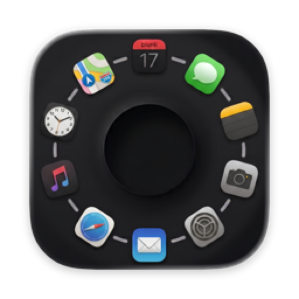

<p align="center">
  
</p>

## AppGrid

**Your own Applications window for macOS.**
A replacement for the system Applications window: it remembers its size, shows every
app you have, and always opens on the full list.

*Własne okno „Aplikacje" dla macOS. Pamięta rozmiar, pokazuje wszystkie programy
i zawsze otwiera się na pełnej liście.*

[](https://developer.apple.com/xcode/)
[](https://www.apple.com/macos)
[](LICENSE)

## Why it exists / Po co to powstało

The system Applications window had three faults that no setting could fix:

1. **It forgot its size.** Resized, it snapped back to small on every return from search.
2. **It did not show every app.** Some were reachable only by typing the name.
3. **It opened on the last search** instead of the full list.

*Systemowe okno gubiło rozmiar, nie pokazywało wszystkich programów i startowało
na ostatnim wyszukiwaniu. AppGrid robi odwrotnie: rozmiar zapamiętuje, listę pokazuje
w całości, a przy każdym otwarciu wraca do pełnego widoku.*

## Features / Funkcje

- ⌨️ **Keyboard first.** Esc hides the window, arrow keys walk the icons, Enter launches
  the selected one. The search field keeps focus the whole time, so you can type and
  steer without reaching for the mouse.
- 🔍 **Search and categories.** Filter by name, or narrow the grid to one category —
  the category picker never types into the search field.
- 🗂 **Two sections.** Everyday apps on top, system utilities below, so the list does not
  drown in tools you open twice a year.
- ✋ **Your own order.** Edit mode lets you drag icons into place and cut the grid with
  named separators. The order is yours and it is saved.
- 🙈 **Hide what you never open.** Hidden apps come back the moment you search for them —
  hiding tidies the view, it does not take the app away.
- 🕒 **Recently installed and recently used**, as two sections or one merged row.
- ⌘ **Global shortcut and a hot corner.** Both optional; the corner has a gamemode switch
  so it stays out of the way while you play.
- 🪟 **Finder window sizes.** Optionally give every Finder window the same size — one for
  all folders, or a remembered size per folder.
- 🎛 **Looks.** Icon size, window width, background opacity, and a window that opens
  centred on the screen your pointer is on.
- 🌍 **English and Polish**, switched with the system language.

## Requirements / Wymagania

- macOS 26 or later
- Xcode 26 or later (to build from source)

## Install / Instalacja

1. Download the ZIP, unzip it and move **AppGrid.app** to **Applications**.
2. The app is not notarized yet, so on first launch **right-click** it → **Open** → **Open**.

> Aplikacja nie jest notaryzowana: przy pierwszym uruchomieniu kliknij ją **prawym
> przyciskiem → Otwórz → Otwórz** (lub: Ustawienia systemowe → Prywatność i bezpieczeństwo
> → *Otwórz mimo to*).

### Permissions / Uprawnienia

| Feature | Permission | If you decline |
|---|---|---|
| Global shortcut, hot corner | Accessibility | The shortcut and the corner stay silent; everything else works |
| Finder window sizes | Automation (Finder) | Finder windows keep their own sizes |

AppGrid makes **no network connections**. It reads the apps you have installed and writes
its own settings — nothing else leaves your Mac.

## Build & Run / Budowanie

```bash
xcodebuild -project AppGrid.xcodeproj -scheme AppGrid -configuration Release build
```

> **Signing / Podpis:** the project pins a local code-signing identity that will not be in
> your keychain. Set **Signing & Capabilities → Signing Certificate** to *Sign to Run
> Locally*, or point it at your own certificate.

The app runs **without the App Sandbox** on purpose: it launches other applications and,
when you turn that on, resizes Finder windows.

## Tests / Sprawdziany

Headless, no Xcode UI and no window:

```bash
# E1 — the app scanner (18 assertions)
cp Harness/E1-test-skanera.swift /tmp/main.swift
swiftc -O AppGrid/AppScanner.swift /tmp/main.swift -o /tmp/E1-test && /tmp/E1-test

# E2 — grid layout, sections, recents, hot corner, shortcut (204 assertions)
cp Harness/E2-test-modulow.swift /tmp/main.swift
swiftc -O AppGrid/AppScanner.swift AppGrid/Ustawienia.swift AppGrid/SkrotGlobalny.swift \
       AppGrid/AktywnyRog.swift AppGrid/OstatnieProgramy.swift AppGrid/OknaFindera.swift \
       AppGrid/PelnyEkran.swift AppGrid/UkladSiatki.swift \
       /tmp/main.swift -o /tmp/E2-test && /tmp/E2-test
```

> The copy to `main.swift` is not decoration: top-level code compiles only in a file
> with that name, otherwise `swiftc` answers *expressions are not allowed at the top level*.

Both suites print control samples first, so a zero reads as "not there" rather than
"the check stopped looking".

## Licence / Licencja

The **source code** is released under the [MIT License](LICENSE).

The **artwork is not**: the app icon (`appgrid ikona.icon/`) and the image in `docs/`
are Copyright (c) 2026 mikagosz, all rights reserved, and are excluded from the MIT
grant — see [NOTICE](NOTICE). They ship with the repository so the project builds as it
is shipped; if you fork it, replace them with your own.

*Kod źródłowy na licencji MIT. Grafika — ikona programu i obrazki w `docs/` — pozostaje
zastrzeżona, patrz [NOTICE](NOTICE).*
